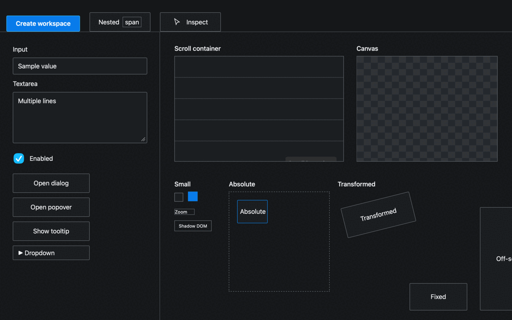
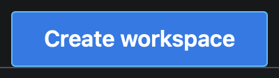

# tauri-plugin-ui-inspector

Select an element inside a running Tauri 2 webview and turn it into a durable `@ui_<ULID>` reference for coding agents.



A reference records the selected DOM node, accessibility semantics, ranked locators, optional framework source metadata, native window pixels, and an exact element crop. The native backend captures what the desktop compositor rendered, including canvas, WebGL, fonts, shadows, and overlays. It does not rebuild the page with a DOM-to-image library.

The plugin is framework-neutral. Development adapters map Svelte 5, React, and Vue 3 elements back to source files; apps without an adapter still get DOM metadata, locators, and screenshots.

## Quick start

Run the checked-in Svelte fixture from a clone:

```sh
pnpm install
cargo install --path crates/ui-inspector
pnpm dev
```

In a second terminal:

```sh
ui-inspector pick
```

Hover a control and click it. The fixture creates output like this:

```text
Waiting for UI selection...
Selected @ui_01M0...
CreateWorkspaceButton: button 'Create workspace' at src/lib/CreateWorkspaceButton.svelte:9:1
src/lib/CreateWorkspaceButton.svelte:9:1
.ui-inspector/refs/ui_01M0.../element.png
```

Fetch the complete record with JSON-only stdout:

```sh
ui-inspector get @ui_01M0... --json
```

## Install in a Tauri app

Install the native plugin, CLI, framework-neutral frontend, and the adapter for your framework:

```toml
# src-tauri/Cargo.toml
[dependencies]
tauri-plugin-ui-inspector = "0.1"
```

```sh
cargo install tauri-ui-inspector
pnpm add @tauri-ui-inspector/inspector
pnpm add -D @tauri-ui-inspector/adapter-svelte
```

Register the plugin. Keep it behind `debug_assertions` unless your application has a deliberate production capture policy.

```rust
fn main() {
    let builder = tauri::Builder::default();

    #[cfg(debug_assertions)]
    let builder = {
        let mut inspector = tauri_plugin_ui_inspector::Builder::new();
        inspector
            .storage_dir(".ui-inspector")
            .max_history(100)
            .crop_padding(8);
        builder.plugin(inspector.build())
    };

    builder
        .run(tauri::generate_context!())
        .expect("Tauri application failed");
}
```

Grant the plugin permission to each inspectable window:

```json
{
  "$schema": "../gen/schemas/desktop-schema.json",
  "identifier": "main-capability",
  "windows": ["main"],
  "permissions": ["core:default", "ui-inspector:default"]
}
```

The default permission allows capture, cancellation, live resolution, and reading the last reference.

## Frontend setup

Install the bridge once in every window that should answer CLI requests. This Svelte example also enables source metadata:

```svelte
<script lang="ts">
  import { onMount } from 'svelte'
  import { installInspectorBridge } from '@tauri-ui-inspector/inspector'
  import { svelteAdapter } from '@tauri-ui-inspector/adapter-svelte'

  onMount(() => {
    let dispose: (() => void) | undefined
    void installInspectorBridge({
      adapters: [svelteAdapter()],
      onSelect(reference) {
        console.info(`Created @${reference.id}`)
      }
    }).then(value => (dispose = value))

    return () => dispose?.()
  })
</script>
```

`installInspectorBridge` has no Svelte dependency. Framework-specific runtime work stays inside adapters.

## Picker behavior

Call `startInspecting()` from an application control, or press `Command+Shift+C` on macOS and `Ctrl+Shift+C` elsewhere after installing the bridge. The shortcut is configurable.

```ts
import { startInspecting, stopInspecting } from '@tauri-ui-inspector/inspector'

const inspector = startInspecting({
  onStarted() {},
  onHovered(element) {},
  onSelect(reference) {},
  onCancel() {},
  onError(error) { console.error(error) }
})

inspector.state // 'inspecting', 'capturing', or 'idle'
stopInspecting()
```

While active, the picker:

- draws a pointer-transparent overlay without changing the inspected element;
- selects interactive ancestors for nested text and SVG children;
- follows scrolling, resizing, and CSS transforms through `getBoundingClientRect()`;
- traverses open shadow roots and supports pointer and mouse events;
- suppresses the inspection click before the application receives it;
- pauses active Web Animations and resumes them after capture;
- preserves the existing focus and hover target where the webview permits it;
- exits on Escape and restores its cursor, listeners, overlay, and animations.

The overlay is hidden before the Rust capture begins, so inspector chrome does not appear in `window.png` or `element.png`.

## Programmatic selection

Use the same metadata and native capture path without the picker:

```ts
import { inspectElement, inspectSelector } from '@tauri-ui-inspector/inspector'
import { svelteAdapter } from '@tauri-ui-inspector/adapter-svelte'

const options = { adapters: [svelteAdapter()] }
const first = await inspectElement(button, options)
const second = await inspectSelector('[data-testid="create-workspace"]', options)
```

`inspectSelector` requires exactly one match. It throws rather than selecting an ambiguous element.

## CLI

```text
ui-inspector pick [--window main]
ui-inspector last
ui-inspector get <id>
ui-inspector list
ui-inspector screenshot <id>
ui-inspector resolve <id> [--window main]
ui-inspector delete <id>
ui-inspector clear
```

The CLI accepts `ui_01...` and `@ui_01...`. Pass `--project /absolute/path` when the current directory is outside the project. Pass `--storage-dir path` when the application uses a non-default store.

`--json` is global and may appear before or after the subcommand. JSON mode writes one valid JSON value to stdout; diagnostics stay on stderr.

| Exit | Meaning |
| ---: | --- |
| 0 | Success |
| 1 | Invalid input, protocol failure, or internal error |
| 2 | Reference not found |
| 3 | Application not running or inspector disabled |
| 4 | Inspection cancelled |
| 5 | Stored element no longer resolves exactly |

`pick` and `resolve` use an authenticated local socket on Unix and a named pipe on Windows. The plugin never opens a TCP listener. If several windows exist, `--window` selects one by Tauri label; otherwise the focused window wins, followed by the first label in lexical order.

## Reference format

Each selection creates one directory:

```text
.ui-inspector/
  run/instance.json
  refs/
    ui_01M0.../
      reference.json
      window.png
      element.png
```

The default history is 100 references. Set `max_history(0)` to disable cleanup. `.ui-inspector/` belongs in `.gitignore` because its JSON and screenshots may contain private UI data.

Schema version 1 includes:

- project and Tauri window identity, geometry, scale factor, and browser viewport metrics;
- role, accessible name and description, common ARIA/native states, safe form metadata, and redacted attributes;
- a compact HTML fragment, parent context, and up to eight DOM ancestors;
- ranked locators with confidence and uniqueness recorded at selection time;
- optional component, source file, line, column, and component ancestry;
- relative screenshot filenames plus the final physical-pixel crop rectangle;
- a deterministic summary written for humans and agents.

Rust owns the schema. `ts-rs` generates [packages/shared/src/generated.ts](packages/shared/src/generated.ts), which prevents a second handwritten TypeScript model.

Unknown JSON object fields are safe for older readers to ignore. A breaking shape change must increment `schemaVersion`.

## Locator policy

The frontend ranks locators in this order:

1. explicit test ID;
2. unique role plus accessible name;
3. unique DOM ID;
4. stable attributes;
5. framework source metadata;
6. generated CSS selector;
7. DOM structural path;
8. exact normalized text.

`@medv/finder` supplies CSS selector generation. The inspector also searches open shadow roots for explicit selectors and semantic matches. Closed shadow roots remain opaque.

Live resolution only tries locators that were unique when captured and have confidence of at least `0.5`. It then checks the original tag, role, and accessible name. If no locator finds exactly one matching element, the CLI exits with code 5 and returns a structured `notFound` result. It never picks a nearby element.

## Accessibility and redaction

`dom-accessibility-api` computes role, accessible name, and accessible description. The collector also records ARIA relationships, disabled, checked, selected, expanded, pressed, placeholder, form label, input type, and optional value.

Form values are off by default. Password, hidden, password-autocomplete, one-time-code, credit-card, and token-like controls never persist a value even when value capture is enabled. Backend redaction runs again before callbacks and disk writes.

```rust
let mut redaction = tauri_ui_inspector_core::RedactionConfig::new();
redaction.redact_text = true;

let mut inspector = tauri_plugin_ui_inspector::Builder::new();
inspector
    .redaction(redaction)
    .capture_screenshots(false)
    .persist_references(false);
```

Frontend options can add attribute-name fragments, redact text before IPC, or opt into safe form values:

```ts
installInspectorBridge({
  redactText: true,
  captureFormValues: false,
  sensitiveAttributeFragments: ['secret', 'token', 'session']
})
```

The plugin has no telemetry and no upload path. It cannot redact secrets that are already rendered into canvas, WebGL, images, or screenshot pixels. Treat the entire store as sensitive.

## Screenshot and crop behavior

Rust uses `xcap` for native window capture and `image` for PNG cropping. `window.png` contains the full captured native window, including decorations where the platform API returns them. `element.png` is cut directly from that bitmap.

The coordinate transform measures browser CSS pixels, `devicePixelRatio`, visual viewport offsets, Tauri geometry, capture-backend bounds, and the returned PNG dimensions. It does not assume that any two spaces use the same unit. On platforms where Tauri reports identical inner and outer geometry, the transform calibrates the content area from `innerWidth × devicePixelRatio` and `innerHeight × devicePixelRatio`.

Padding is measured in CSS pixels before scaling. The default is 8; `0`, `8`, `16`, and `32` are useful presets. Partially visible elements are clamped to the bitmap. Fully disjoint rectangles fail.

The checked-in E2E run used a 1280×800 CSS viewport on a Retina display at 2×. It produced a 2560×1664 native window image and a 400×112 crop for a 184×40 button with 8 CSS pixels of padding. The E2E test compares every crop pixel against its declared region in `window.png`.



## Framework source metadata

The Svelte, React, and Vue adapters delegate runtime source recovery to `element-source` and its maintained framework resolvers. In development builds they can recover the selected source location and component ancestry from framework metadata.

Production compilation removes that metadata. The adapter then returns `undefined`, while DOM collection, locators, screenshots, and persistence keep working.

Keep source recovery optional in application logic. Production compilers may remove framework development metadata.

```ts
import { reactAdapter } from '@tauri-ui-inspector/adapter-react'
import { vueAdapter } from '@tauri-ui-inspector/adapter-vue'

installInspectorBridge({ adapters: [reactAdapter()] })
installInspectorBridge({ adapters: [vueAdapter()] })
```

## Agent and Codex use

The included [UI inspector skill](skills/ui-inspector/SKILL.md) tells Codex to resolve an `@ui_` reference through the CLI, inspect `element.png` first, open `window.png` when context matters, verify the recorded source, and refuse fuzzy substitutions.

Copy or install that skill in your Codex environment. Then a request can be as short as:

```text
Fix the padding on @ui_01M0...
```

The plugin itself has no Codex dependency. `onSelect` in TypeScript and `on_reference_created` in Rust support other local consumers:

```rust
inspector.on_reference_created(|reference| {
    println!("Created @{}", reference.id);
});
```

## Framework adapters

An adapter has one job:

```ts
export interface FrameworkInspectorAdapter {
  readonly name: string
  inspect(element: Element): SourceInfo | undefined | Promise<SourceInfo | undefined>
}
```

Return framework, component, source location, and ancestry when the runtime exposes them. Return `undefined` when metadata is absent. The published Svelte, React, and Vue adapters keep runtime probes in their own packages; the picker and backend do not import those frameworks.

## Platform support

| Platform | Capture path | Notes |
| --- | --- | --- |
| macOS | `xcap` window capture | Screen Recording permission may be required. Native E2E, negative monitor coordinates, 1×, and Retina 2× were exercised in this repository. |
| Windows | `xcap` window capture | Protected or elevated windows can reject capture. Named-pipe IPC is local to the machine. |
| Linux X11 | `xcap` window capture | The application needs access to the active X session. |
| Linux Wayland | compositor-dependent | Some compositors deny direct window capture or require portal consent. Treat failure as a platform limitation, not an empty screenshot. |

The pure coordinate, storage, schema, redaction, and protocol tests run without a desktop. Native screenshot behavior still needs platform runners or a real desktop session.

## Contributing

Start every proposed change in a
[GitHub Discussion](https://github.com/mathematic-inc/tauri-plugin-ui-inspector/discussions/new)
and wait for a Mathematic maintainer to review it. We maintain this repository
with AI agents, and reviewing an unsolicited pull request usually takes longer
than implementing an agreed proposal ourselves.

If we decide to proceed, a Mathematic maintainer or agent will open the pull
request. When Mathematic implements a proposal, the implementation pull request
will link to the Discussion and credit its original author.

GitHub restricts pull request creation to Mathematic maintainers and repository
collaborators with write, maintain, or admin access, plus authorized maintenance
agents. See [CONTRIBUTING.md](CONTRIBUTING.md) for the full process.

## Tests

```sh
cargo fmt --all -- --check
cargo test --workspace
cargo clippy --workspace --all-targets --all-features -- -D warnings
pnpm check
pnpm test
pnpm build
pnpm e2e
```

The test suite covers coordinate calibration and cropping, negative monitor coordinates, HiDPI scaling, page zoom, partial visibility, storage locking and cleanup, IDs, serialization, redaction, DOM and ARIA extraction, locator ranking, exact resolution, open shadow roots, picker cleanup and event suppression, Svelte metadata, local IPC, native screenshots, CLI JSON, and pixel-level crop equality.

`pnpm e2e` starts the Vite development server, builds a debug Tauri fixture with an embedded local WebDriver, drives a CLI `pick`, hovers and clicks the known button, checks source metadata and both PNGs, resolves the reference through the CLI, and shuts the app down. The WebDriver plugins are compiled and registered only by the fixture's `e2e` feature.

The fixture page includes nested text, SVG, forms, a scroll boundary, fixed and absolute controls, transforms, CSS zoom, dialog, popover, tooltip, dropdown, canvas, WebGL, open shadow DOM, a tiny target, and a partially off-screen target.

## Development and releases

The repository pins Rust, Node, pnpm, hk, and every lint/release tool through mise:

```sh
mise install
pnpm install
hk install
hk check --all
```

Release Please keeps the three crates and five npm packages on one linked version. Its release PR updates manifests, lockfiles, and changelogs. Merging that PR creates the plugin's `v<version>` tag and component releases. The release workflow publishes crates in dependency order and publishes pnpm-built tarballs through npm trusted publishing. GitHub Actions are pinned to commit SHAs.

## Troubleshooting

`ui-inspector pick` says the app is not running:

- Run the command from the project tree or pass `--project`.
- Confirm `.ui-inspector/run/instance.json` exists.
- Confirm the Rust plugin and frontend bridge are both installed.
- A stale discovery file is harmless; the CLI reports exit code 3 when its socket no longer exists.

The CLI waits until timeout:

- Check the requested `--window` label.
- Confirm the target window installed `installInspectorBridge`.
- Make sure another pick or resolve operation is not active.

Source metadata is missing:

- Run the frontend through the Svelte/Vite development server.
- Confirm `svelteAdapter()` is in the bridge's `adapters` list.
- Expect source metadata to be absent in production bundles.

The crop is offset:

- Inspect `window.viewport`, Tauri geometry, `capture.screenshotSize`, and `capture.pixelCrop` in `reference.json`.
- Record the display scale, page zoom, decoration size, and monitor coordinates.
- Add the case to `crates/ui-inspector-core/tests/coordinate_transform.rs` before changing the transform.

The screenshot is denied or blank:

- Grant macOS Screen Recording permission and restart the app.
- Check Windows elevation and protected-window rules.
- On Linux, confirm X11 access or the Wayland compositor's capture policy.

## Architecture and current scope

[docs/architecture.md](docs/architecture.md) records ownership boundaries, dependency choices, rejected alternatives, coordinate math, IPC security, and extension rules.

Single-element capture is complete. `ReferenceKind` reserves `group` and `region` so later schema versions can add Shift-click groups or arbitrary regions without replacing the top-level discriminator. Those modes are not exposed yet; adding them now would complicate the verified single-selection path without a working consumer.

## License

Licensed under either Apache-2.0 or MIT, at your option.
